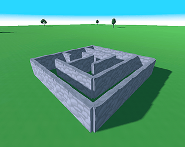
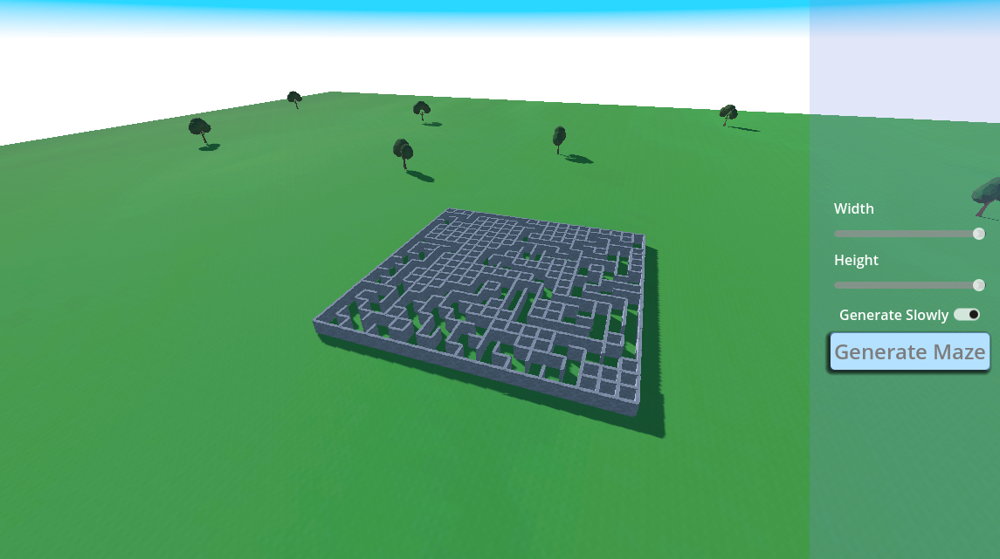

<!-- PROJECT LOGO -->
 

  

<h3 align="center">Godot Maze Generator</h3>

  

    Generate 3D mazes.
     
     
    <a href="https://guibdbello.itch.io/godot-maze-generator">View Demo</a>
  

<!-- TABLE OF CONTENTS -->

  
Table of Contents

  <ol>
    <li>
      <a href="#about-the-project">About The Project</a>
    </li>

<!-- ABOUT THE PROJECT -->
## About The Project

Generate perfect mazes in your web browser in this game made with Godot.

(<a href="#readme-top">back to top</a>)

