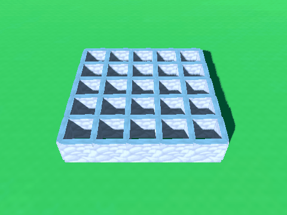

<h1 align="center">Godot Maze Generator</h1>
 

  

  3D maze generation powered by Godot.
   
   
  <a href="https://guibdbello.itch.io/godot-maze-generator">Play Game</a>
  ·
  <a href="https://github.com/GuiBDBello/godot-maze-generator/issues/new?labels=bug&template=bug-report---.md">Report Bug</a>
  ·
  <a href="https://github.com/GuiBDBello/godot-maze-generator/issues/new?labels=enhancement&template=feature-request---.md">Request Feature</a>

## Table of Contents

<ol>
  <li><a href="#introduction">Introduction</a></li>
  <li><a href="#getting-started">Getting Started</a></li>
  <li><a href="#build-process">Build Process</a></li>
  <li><a href="#acknowledgments">Acknowledgments</a></li>
  <li><a href="#license">License</a></li>
</ol>

## Introduction

Generate 3D mazes in your web browser in this game made with Godot.

  

### How to Play

- Click and drag **Left Mouse Button** to rotate the camera.
- Use the **Mouse Scroll Wheel** to zoom in or zoom out.

Change the Width and Height of the maze, choose if you want it to be generated slowly or not and then click `Generate Maze`.

(<a href="#readme-top">back to top</a>)

## Getting Started

To get a local copy up and running follow the steps below.

### Prerequisites

1. [Godot](https://godotengine.org/)

### Configuration

1. Clone repository: `git clone https://github.com/GuiBDBello/godot-maze-generator.git`.
1. Import the project in Godot: `Import > Select the project folder > Import & Edit`.

(<a href="#readme-top">back to top</a>)

## Build Process

1. In Godot, select `Project > Export...`.
1. Select the `Presets`.
1. Click on `Export Project...`.
1. Select the folder and press `Save`.

(<a href="#readme-top">back to top</a>)

## Acknowledgments

List of references that were useful in the making of this project:

* [Maze generation algorithm](https://en.wikipedia.org/wiki/Maze_generation_algorithm)

(<a href="#readme-top">back to top</a>)

## License

Distributed under the MIT License. See [LICENSE](./LICENSE) for more information.

(<a href="#readme-top">back to top</a>)

